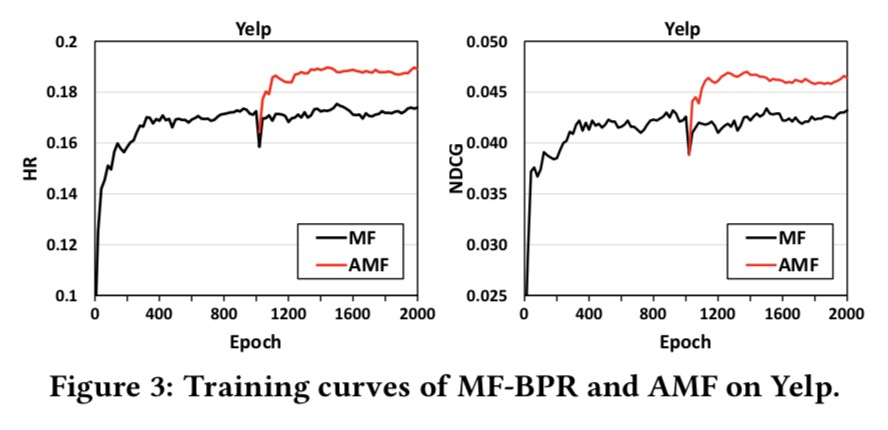

# Adversarial Personalized Ranking for Recommendation

APR enhances the pairwise ranking method BPR by performing adversarial training. To illustrate how it works,  APR on MF is implemented here by adding adversarial perturbations on the embedding vectors of users and items.

This is our official implementation for the paper:

**Adversarial Personalized Ranking for Recommendation**  Xiangnan He, Zhankui He, Xiaoyu Du & Tat-Seng Chua, *SIGIR 2018*  (Corresponding Author: [Dr. Xiangnan He][http://www.comp.nus.edu.sg/~xiangnan/])

If you use the codes, please cite our paper . Thanks!

## Environment

Python 2.7

TensorFlow >= r1.0

Numpy >= 1.12

##Quick to Start



####Demo:  Effect of APR

This command shows the effect of APR by adding adversarial perturbation on **pretrained** MF model for dataset yelp in epoch 40.  

```shell
python AMF.py --dataset yelp --adv_epoch 40 --epochs 1000 --eps 0.5 --reg_adv 1 --verbose 20 --restore 2018_05_06_16_09_24
```

or use  `./demo.sh` for short.

####Training: From MF to AMF

To launch the entire training experiment quickly, you can use:

```shell
python AMF.py --dataset yelp --adv_epoch 1000 --epochs 2000 --eps 0.5 --reg_adv 1 --ckpt 1 --verbose 20
```

or `./train.sh yelp`  for short.  

Use `python AMF.py -h`  to get more argument setting details.

##Dataset

We provide three processed datasets:  Yelp(yelp), MovieLens 1 Million (ml-1m) and Pinterest (pinterest-20) in Data/

**train.rating:**

- Train file.


- Each Line is a training instance: userID\t itemID\t rating\t timestamp (if have)

**test.rating:**

- Test file (positive instances).
- Each Line is a testing instance: userID\t itemID\t rating\t timestamp (if have)

**test.negative**

- Test file (negative instances).
- Each line corresponds to the line of test.rating, containing 99 negative samples.
- Each line is in the format: (userID,itemID)\t negativeItemID1\t negativeItemID2 ...

Update: May 7, 2018